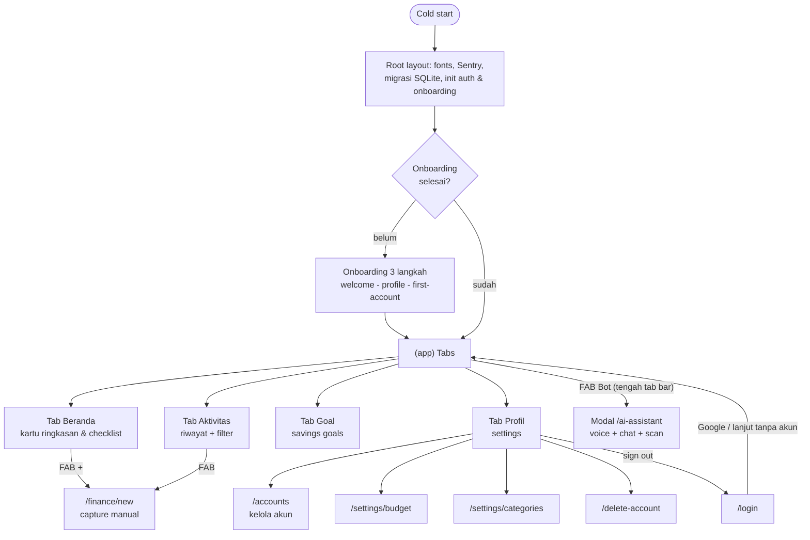
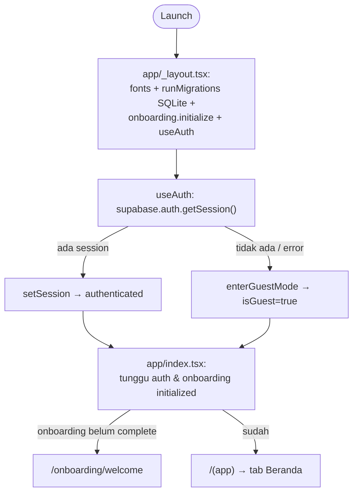
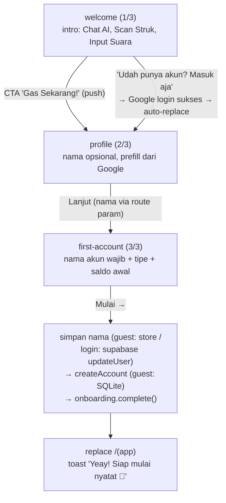
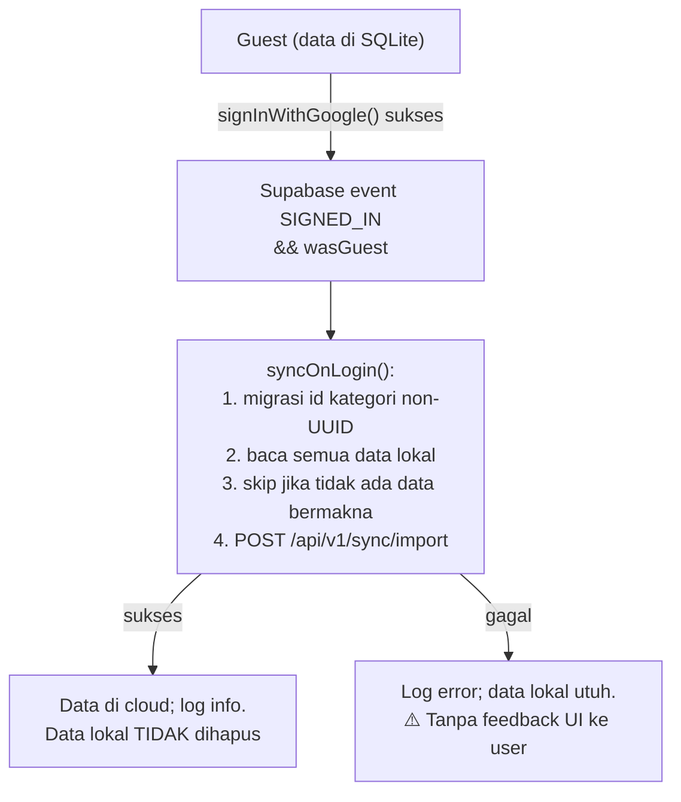
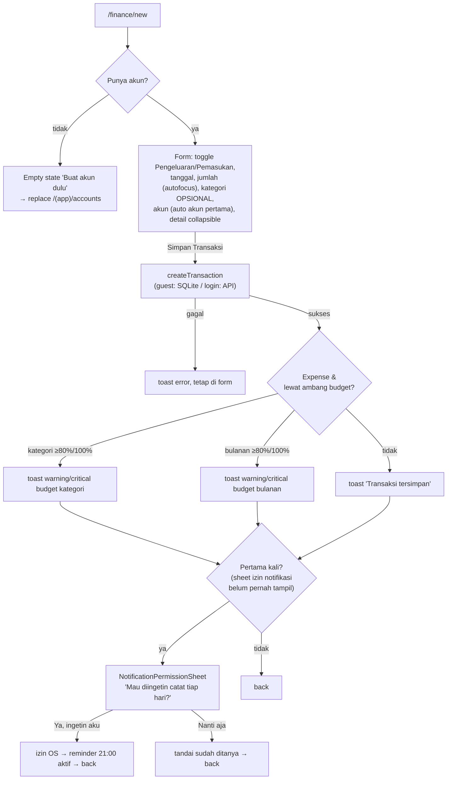
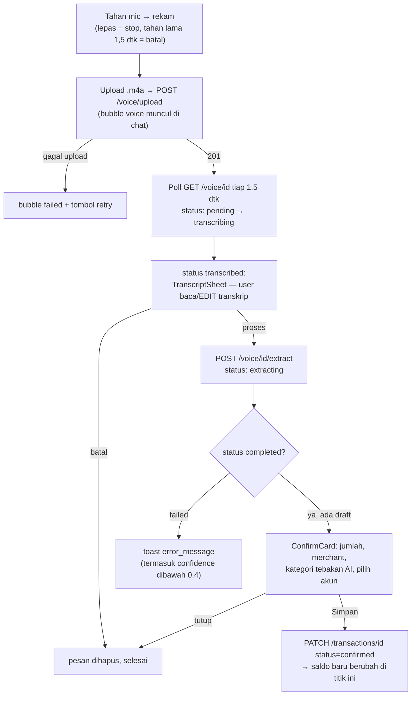
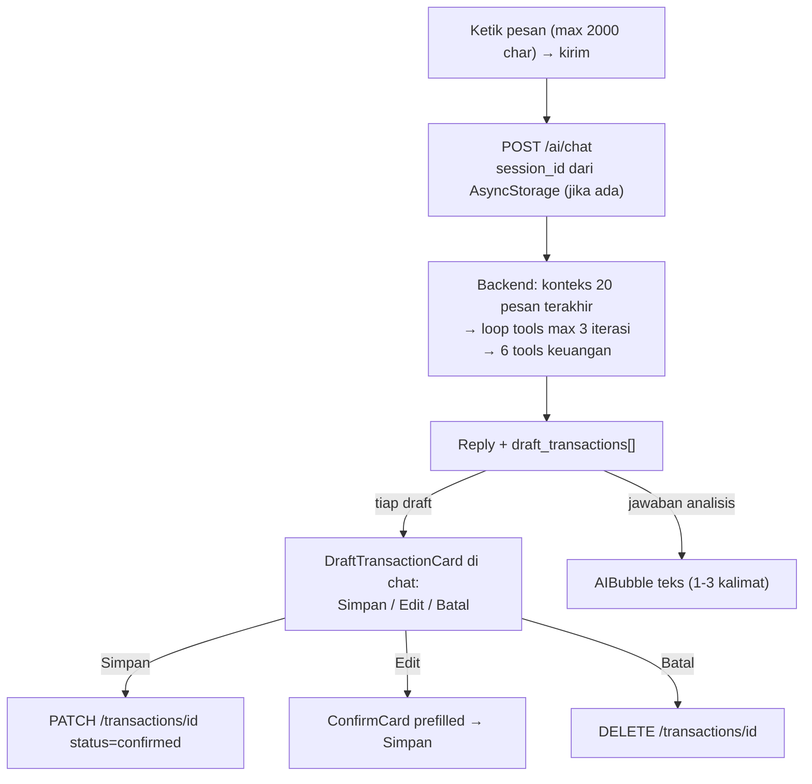
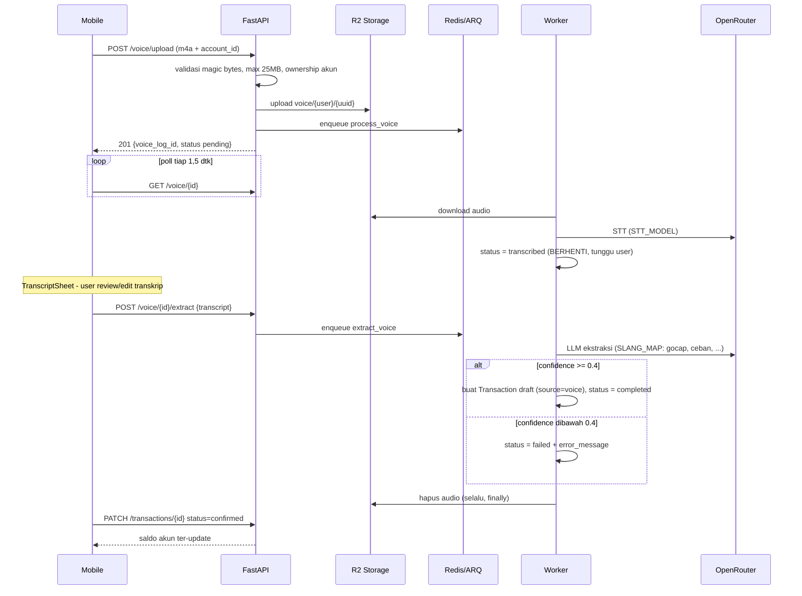
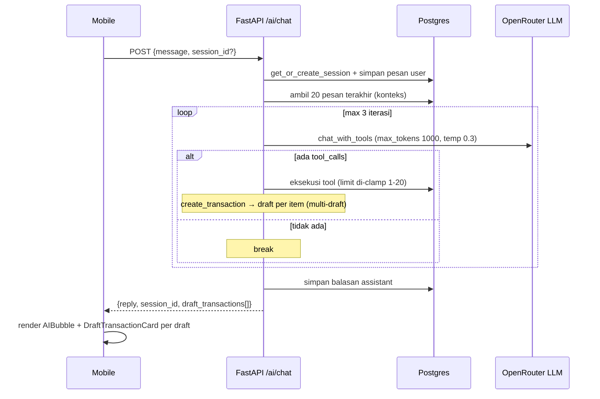

# User Flows — Savyn

| | |
|---|---|
| **Versi dokumen** | 1.0 |
| **Tanggal** | 10 Juli 2026 |
| **Memotret** | Kondisi kode v1.0 (pre-launch Play Store) — apa adanya, bukan rencana |
| **Pasangan** | `docs/PRD.md` (kenapa & ke mana), dokumen ini (bagaimana alurnya hari ini) |

> Semua path file relatif dari root repo. Istilah **kanal** dan friksi **F1–F5** mengacu ke PRD §2. Diagram memakai Mermaid (render otomatis di GitHub & VS Code).

---

## §0 Cara Membaca & Memelihara Dokumen Ini

**Tujuan dokumen:** satu sumber kebenaran alur produk agar penambahan fitur konsisten, onboarding kolaborator/AI agent cepat, dan smoke test punya naskah. Kalau dokumen ini dan kode tidak cocok, **kode yang benar** — perbaiki dokumen di PR yang sama.

**Aturan pemeliharaan (wajib):**

1. Setiap PR yang menambah/mengubah layar, navigasi, atau alur data user → perbarui bagian terkait di sini (minimal: route map §2 dan flow yang tersentuh).
2. Flow baru ditulis memakai **template** di bawah — jangan improvisasi format.
3. Fitur yang belum ada TIDAK ditulis sebagai flow. Sebutkan hanya sebagai catatan `Keterbatasan v1.0` dengan rujukan PRD.
4. Event analytics (§9) adalah **spesifikasi** sampai instrumentasi Fase 1 terpasang; saat implementasi, tandai statusnya di tabel §9.

**Template flow baru:**

```markdown
### <Nama flow>
**Tujuan user:** ...
**Entry points:** semua titik masuk (layar + komponen + file:baris)
**Prasyarat:** auth/guest, data yang harus ada
**Happy path:** (diagram Mermaid atau langkah bernomor)
**Cabang & edge case:** ...
**Perilaku guest/offline:** ...
**Event analytics:** rujuk ID di §9
**File terkait:** ...
```

---

## §1 Peta Produk Level Atas

Savyn = 4 tab + 1 modal AI. Jantung produk adalah **capture transaksi** lewat 4 kanal: manual, voice, chat AI, scan struk (§4).



Guest dan user login melewati pohon yang sama; perbedaannya di sumber data (§8): guest = SQLite lokal, login = API. Fitur AI (voice/chat/scan/insight) khusus user login.

---

## §2 Route Map

Semua route expo-router di `mobile/app/`. Akses: 🟢 = guest OK (data lokal), 🔒 = butuh login, ⚪ = publik/gating.

| File | Route | Layar | Akses |
|---|---|---|---|
| `app/_layout.tsx` | — | Root stack (Sentry, fonts, migrasi DB, `ai-assistant` sebagai modal) | ⚪ |
| `app/index.tsx` | `/` | Gating: redirect onboarding atau `(app)` | ⚪ |
| `app/login.tsx` | `/login` | Login Google / lanjut tanpa akun | ⚪ |
| `app/ai-assistant.tsx` | `/ai-assistant` | Modal AI: voice + chat + scan | 🔒 (guest → GuestGate) |
| `app/delete-account.tsx` | `/delete-account` | Hapus akun permanen | 🔒 |
| `app/onboarding/_layout.tsx` | — | Stack onboarding | ⚪ |
| `app/onboarding/welcome.tsx` | `/onboarding/welcome` | Step 1/3: intro + login opsional | ⚪ |
| `app/onboarding/profile.tsx` | `/onboarding/profile` | Step 2/3: nama (opsional) | ⚪ |
| `app/onboarding/first-account.tsx` | `/onboarding/first-account` | Step 3/3: akun pertama (wajib) | ⚪ |
| `app/(app)/_layout.tsx` | — | Stack app (anchor `(tabs)`) | — |
| `app/(app)/(tabs)/_layout.tsx` | — | Tabs + `FloatingTabBar` (FAB Bot tengah) | — |
| `app/(app)/(tabs)/(home)/_layout.tsx` | — | Stack tab Beranda | — |
| `app/(app)/(tabs)/(home)/index.tsx` | `/(app)` | **Beranda** — kartu ringkasan (§6) | 🟢 |
| `app/(app)/(tabs)/(home)/[id].tsx` | `/(app)/[id]` | Re-export `finance/[id]` (detail di dalam stack home, tab bar tetap terlihat) | 🟢 |
| `app/(app)/(tabs)/(home)/history.tsx` | `/(app)/history`* | Re-export `finance/history` | 🟢 |
| `app/(app)/(tabs)/history/_layout.tsx` | — | Stack tab Aktivitas | — |
| `app/(app)/(tabs)/history/index.tsx` | `/(app)/history` | **Aktivitas** — riwayat + search + filter | 🟢 |
| `app/(app)/(tabs)/goals/_layout.tsx` | — | Stack tab Goal | — |
| `app/(app)/(tabs)/goals/index.tsx` | `/(app)/goals` | Daftar savings goals | 🟢 |
| `app/(app)/(tabs)/goals/[id].tsx` | `/(app)/goals/[id]` | Detail goal + kontribusi | 🟢 |
| `app/(app)/(tabs)/settings/_layout.tsx` | — | Stack tab Profil | — |
| `app/(app)/(tabs)/settings/index.tsx` | `/(app)/settings` | **Profil** — menu keuangan, notifikasi, legal, keluar | 🟢 |
| `app/(app)/(tabs)/settings/budget.tsx` | `/(app)/settings/budget` | Budget bulanan + limit per kategori | 🟢 |
| `app/(app)/(tabs)/settings/categories.tsx` | `/(app)/settings/categories` | Kelola kategori | 🟢 |
| `app/(app)/(tabs)/settings/profile.tsx` | `/(app)/settings/profile` | Edit profil (nama + avatar dari galeri) | 🔒 |
| `app/(app)/accounts/_layout.tsx` | — | Stack akun | — |
| `app/(app)/accounts/index.tsx` | `/(app)/accounts` | Daftar akun + sheet buat akun | 🟢 |
| `app/(app)/accounts/[id].tsx` | `/(app)/accounts/[id]` | Detail akun: edit / hapus (arsip) | 🟢 |
| `app/(app)/finance/_layout.tsx` | — | Stack finance | — |
| `app/(app)/finance/index.tsx` | `/(app)/finance` | Dashboard "Keuangan" — **⚠️ route yatim** (lihat catatan) | 🟢 |
| `app/(app)/finance/new.tsx` | `/(app)/finance/new` | **Transaksi baru (capture manual)** | 🟢 |
| `app/(app)/finance/[id].tsx` | `/(app)/finance/[id]` | Detail transaksi: edit / hapus | 🟢 |
| `app/(app)/finance/history.tsx` | `/(app)/finance/history` | Riwayat versi simpel (tanpa filter sheet) | 🟢 |
| `app/(app)/finance/budget.tsx` | `/(app)/finance/budget` | Re-export `settings/budget` (target navigasi dari Home) | 🟢 |

*Catatan route:*
- **⚠️ `finance/index.tsx` (dashboard "Keuangan") tidak pernah dituju navigasi mana pun** (grep `router.push` = nol). Fungsinya sudah digantikan tab Beranda — kandidat dibersihkan atau dijadikan target navigasi eksplisit.
- Re-export (`(home)/[id]`, `(home)/history`, `finance/budget`) ada agar layar yang sama bisa dirender di stack berbeda (di dalam tab, tab bar tetap tampak). Navigasi aktual yang terlacak memakai `/(app)/history` (dari TopCategoriesCard) dan `/(app)/finance/...`.
- Konvensi navigasi: JANGAN `router.push('/(app)/accounts/index')` — lihat `mobile/AGENTS.md` §2.

---

## §3 Flow Lifecycle

### 3.1 Cold start & gating

**Tujuan user:** buka app → langsung ke tempat yang benar.
**Entry points:** launch app / kembali dari background.



**Cabang & edge case:** migrasi/init gagal → dicatat logger, app tetap lanjut (`dbReady` tetap true); sebelum initialized tampil spinner.
**Perilaku guest/offline:** tidak ada session = guest — bukan error. Backend down → user login tetap masuk UI, query API gagal per-kartu.
**File terkait:** `mobile/app/_layout.tsx`, `mobile/app/index.tsx`, `mobile/src/hooks/useAuth.ts`, `mobile/src/stores/{auth,onboarding}.ts`.

### 3.2 Onboarding (3 langkah)

**Tujuan user:** dari install ke siap mencatat < 2 menit.
**Entry points:** cold start dengan onboarding belum complete.



**Cabang & edge case:**
- Login dari welcome TIDAK men-skip langkah — user login tetap lewat profile & first-account (`welcome.tsx` auto-`replace` saat `initialized && !isGuest`).
- Nama boleh kosong (skip implisit); nama akun wajib.
- `createAccount` gagal → toast "Gagal bikin akun...", onboarding TIDAK complete → cold start berikutnya kembali ke welcome.
- `complete()` hanya dipanggil di satu tempat: `first-account.tsx` — tidak ada jalur lain menandai onboarding selesai.

**Perilaku guest/offline:** guest end-to-end offline (akun ke SQLite, nama ke AsyncStorage).
**Event analytics:** E-OB1..E-OB3, E-ACT1 (§9).
**File terkait:** `mobile/app/onboarding/{welcome,profile,first-account}.tsx`, `mobile/src/stores/onboarding.ts`.

### 3.3 Login, guest → signup (migrasi data), sign out

**Tujuan user:** pindah guest ↔ login tanpa kehilangan data.
**Entry points login/signup:** (a) welcome "Masuk aja"; (b) `/login` (muncul setelah sign out / hapus akun); (c) Profil → "Backup & Sinkronisasi" (khusus guest); (d) GuestGate di modal AI → tombol "Masuk ke Akun" → `/(app)/settings`.



**Detail backend import** (urutan; semua idempoten `ON CONFLICT (id) DO NOTHING`): accounts → categories → filter transaksi yang akun/kategorinya bukan milik user (di-skip + warning log) → transactions (dipaksa `status=confirmed`) → apply delta saldo per akun (`FOR UPDATE`, hanya dari baris baru → re-import tidak double-count) → budget (upsert) → savings goals. Batas 5000 item/list, rate limit 10 req/jam.

**Sign out:** Profil → "Keluar" → Alert konfirmasi → supabase signOut + `queryClient.clear()` + masuk guest mode → `replace /login`. Dari `/login` bisa Google lagi atau "Lanjut tanpa akun →" (kembali sebagai guest; data lokal lama masih ada).

**Cabang & edge case:** sync gagal diam-diam (hanya log) — user tidak tahu datanya belum di-backup; smoke test rilis (PRD §5 #5) wajib melewati jalur ini.
**Event analytics:** E-AUTH1..E-AUTH4, E-SYNC1 (§9).
**File terkait:** `mobile/src/hooks/useAuth.ts`, `mobile/src/features/sync/{useSyncOnLogin,syncService,api}.ts`, `backend/app/domains/sync/`, `mobile/app/login.tsx`, `mobile/src/components/ui/GuestGate.tsx`, `mobile/src/features/finance/components/GuestModeBanner.tsx`.

### 3.4 Hapus akun permanen (kebijakan Play Store)

**Entry points:** Profil (hanya user login) → "Hapus Akun" → `/delete-account`.
**Happy path:** layar peringatan (daftar data yang hilang) → tombol hapus → Alert "tidak dapat dibatalkan" → `useDeleteAccount` (API menghapus data + objek R2) → toast → signOut → `replace /login`.
**Cabang:** gagal → toast "Gagal menghapus akun", tetap di layar.
**File terkait:** `mobile/app/delete-account.tsx`, `mobile/src/features/account/hooks/useDeleteAccount.ts`.

---

## §4 Flow Capture — Jantung Produk (4 kanal)

> Reposisi PRD §2.5: tidak ada kanal tunggal — tiap situasi punya kanal tercepatnya. Matriks situasi × kanal ada di PRD §2.4. Target PRD: capture chat & manual **< 10 detik** (belum diukur — §9).

### 4.1 Manual (form)

**Tujuan user:** catat transaksi dalam hitungan detik, kategori tidak menghambat (F4).
**Entry points (semua → `/(app)/finance/new`):**
| Dari | Komponen |
|---|---|
| Beranda | FAB `+` (`(home)/index.tsx:109`) |
| Beranda | `AccountBalanceCard` state kosong (`AccountBalanceCard.tsx:48`) |
| Beranda | Checklist first-run item 2 (`HomeFirstRunChecklist.tsx`) |
| Tab Aktivitas | FAB (`history/index.tsx:350`) |
| Riwayat (stack finance) | FAB (`finance/history.tsx:239`) |
| Dashboard Keuangan (yatim) | tombol tambah (`finance/index.tsx:77`) |



**Desain anti-friksi yang sudah ada (jaga saat refactor):** kategori opsional; jumlah autofocus; merchant/catatan disembunyikan di balik toggle; akun otomatis terpilih.
**Perilaku guest/offline:** penuh via SQLite.
**Event analytics:** E-CAP1/E-CAP2 (channel=`manual`), E-BGT1, E-NOTIF1 (§9).
**File terkait:** `mobile/app/(app)/finance/new.tsx`, `mobile/src/features/finance/utils/budgetAlert.ts`, `mobile/src/features/finance/hooks/useNotificationPermissionGate.ts`.

### 4.2 Voice (di modal AI) — dua tahap dengan review transkrip

**Tujuan user:** "tadi makan siang 25 ribu" → transaksi, tanpa mengetik. Kanal situasional (privat) per PRD §2.5.
**Entry points:** FAB Bot (tab bar) → `/ai-assistant` → **tahan** tombol mic (input bar).
**Prasyarat:** login (guest → GuestGate); punya ≥ 1 akun aktif (kalau tidak → toast "Buat akun dulu"). Audio memakai akun aktif pertama.



**Cabang & edge case:**
- **Guardrail confidence < 0.4** (backend `extractor.py`) → status `failed` + pesan minta audio lebih jelas.
- **Timeout klien 60 detik** per tahap → pesan di-set failed lokal, toast "Pemrosesan kelamaan".
- Rate limit 60 req/jam per user → 429.
- Draft TIDAK memengaruhi saldo sampai dikonfirmasi; audio di R2 selalu dihapus setelah worker selesai (sukses/gagal); tidak ada retry otomatis worker.
- Izin mic ditolak OS → rekaman tidak dimulai (state recorder error).

**Event analytics:** E-CAP1/E-CAP2 (channel=`voice`, tahap terpisah E-VOICE1..3), E-DRAFT1..3 (§9).
**File terkait:** `mobile/app/ai-assistant.tsx`, `mobile/src/hooks/useVoiceRecorder.ts`, `mobile/src/features/finance/hooks/useVoice.ts`, `backend/app/domains/finance/routers/voice.py`, `backend/app/workers/voice_processor.py`, `backend/app/domains/finance/extractor.py`. Sequence penuh: §7.1.

### 4.3 Chat AI (teks) — kanal kerja harian di ruang publik

**Tujuan user:** ketik "sate 20rb parkir 2rb" → draft transaksi (bisa multi), atau tanya "budget makan sisa berapa".
**Entry points:** modal AI → ketik di input bar (tombol mic berubah jadi send saat ada teks); quick chips ("Catat pengeluaran", "Catat pemasukan", "Analisa keuanganku").



**6 tools backend:** `get_financial_summary`, `get_accounts`, `get_budget_status`, `get_recent_transactions`, `get_spending_by_category`, `create_transaction` (dipanggil sekali per item → **multi-draft** dari satu kalimat).
**Persistensi:** session id di AsyncStorage; buka ulang modal → GET `/ai/sessions/{id}/messages` (20 pesan terakhir + draft yang masih `status=draft` → kartu draft di-rehydrate). Hapus percakapan: menu ⋮ → Alert → clear (chat baru).
**Cabang & edge case:** scope dibatasi keuangan (off-topic ditolak via system prompt); `max_tokens=1000`; limit query di-clamp 1–20 sebelum SQL; reply kosong → fallback "Maaf, aku belum bisa jawab itu sekarang..."; rate limit 60/jam; guest → GuestGate.
**Event analytics:** E-CAP1/E-CAP2 (channel=`chat`), E-CHAT1..2, E-DRAFT1..3 (§9).
**File terkait:** `mobile/src/features/ai/hooks/useChat.ts`, `backend/app/domains/ai/{router,tools}.py`. Sequence: §7.2.

### 4.4 Scan struk (kamera) — vision LLM

**Tujuan user:** foto struk kertas → draft transaksi.
**Entry points:** modal AI → tombol kamera (input bar) atau quick chip "📷 Scan struk".

Langkah: `launchCameraAsync` (kamera langsung, kualitas 0.8) → batal = no-op → upload → `POST /receipt/upload` (max 10 MB, magic bytes jpeg/png/webp/gif) → worker vision LLM (`RECEIPT_MODEL`, default gemini-flash-1.5) langsung ekstraksi **satu tahap** (`pending → extracting → completed/failed`, tanpa review transkrip) → poll 1,5 dtk → `completed` → ConfirmCard → PATCH confirm. Gagal/timeout 60 dtk → toast + bubble failed dengan retry.

**Keterbatasan v1.0 (celah capture #1, PRD §2.5):** hanya kamera — **tidak ada import screenshot/galeri**, padahal bukti QRIS/e-wallet berbentuk layar. Ironisnya galeri sudah dipakai untuk avatar profil (`settings/profile.tsx:31` `launchImageLibraryAsync`) — pipeline teknisnya tinggal disambungkan (roadmap PRD §7 Fase 2).
**Catatan konsistensi:** tidak ada guardrail confidence untuk receipt (beda dari voice) — `receipt_extractor.py` tidak memeriksa 0.4.
**Event analytics:** E-CAP1/E-CAP2 (channel=`receipt`), E-DRAFT1..3 (§9).
**File terkait:** `mobile/src/features/finance/hooks/useReceipt.ts`, `backend/app/domains/finance/routers/receipt.py`, `backend/app/workers/voice_processor.py` (job `process_receipt`), `backend/app/domains/finance/receipt_extractor.py`. Sequence: §7.3.

---

## §5 Flow Manajemen

Format ringkas: entry → aksi → konfirmasi. Semua 🟢 guest-OK via repository lokal (§8).

| Flow | Entry points | Aksi & catatan |
|---|---|---|
| **Akun — daftar/buat** | Profil → "Kelola Akun"; empty state form transaksi; checklist item 1 | Bottom sheet: nama (wajib), tipe `cash/bank/ewallet/credit` (default bank), saldo awal (default 0) |
| **Akun — edit/hapus** | Daftar akun → tap kartu → `/accounts/[id]` | Edit nama & saldo awal. "Hapus" (Alert) sebenarnya **arsip** (soft-delete, `useArchiveAccount`) — ⚠️ copy UI bilang "dihapus permanen"; akun terarsip hilang dari daftar & filter |
| **Transaksi — riwayat** | Tab Aktivitas; TopCategoriesCard (pre-filter kategori+bulan via params); "Lihat semua" dashboard | Search teks, navigasi bulan ←→, sheet filter: kategori multi-select + rentang tanggal custom; grup per hari ("Hari ini/Kemarin") |
| **Transaksi — detail/edit/hapus** | Tap kartu transaksi (Aktivitas, Beranda, riwayat) → `/finance/[id]` | Lihat sumber kanal (label Suara/Struk/Manual/Import); edit inline semua field; hapus dengan Alert |
| **Budget** | Profil → "Budget Bulanan"; MonthlyBudgetCard (Beranda) → `/finance/budget`; checklist item 3 | Hero budget bulanan + edit sheet; limit per kategori (add/edit sheet); chip sisa alokasi; performa tahunan |
| **Kategori** | Profil → "Kategori" | Grid 4 kolom, filter Semua/Pengeluaran/Pemasukan; buat/edit via sheet; hapus (Alert) = arsip; 35 kategori default di-seed |
| **Goals** | Tab Goal → `+` (sheet buat); tap kartu → `/goals/[id]` | Detail: kontribusi via sheet (nilai negatif = tarik dana), hitung "perlu nabung/bulan"; edit & hapus (Alert) di header |
| **Profil** | Profil → hero (hanya login) → `/settings/profile` | Edit nama + foto (galeri, crop 1:1); simpan → toast → back |

**File terkait:** `mobile/app/(app)/accounts/*`, `mobile/app/(app)/(tabs)/{history,goals,settings}/*`, `mobile/app/(app)/finance/*`, hooks di `mobile/src/features/finance/hooks/`.

---

## §6 Flow Proaktif (diferensiasi "asisten", PRD §1)

### 6.1 Budget alert 80%/100% saat input

- Logika: `computeBudgetAlert(limit, currentSpend, newAmount)` — `≥ 0.8` warning, `≥ 1.0` critical (`mobile/src/features/finance/utils/budgetAlert.ts`).
- Prioritas: budget **kategori** dicek dulu, fallback budget **bulanan**. Bentuk: toast (warning kuning / error merah) + sisa budget.
- ⚠️ **Hanya di form manual** (`finance/new.tsx`) — konfirmasi draft AI (voice/chat/scan) TIDAK memicu alert. Kesenjangan yang layak ditutup jika share kanal AI tinggi (sinyal §9).
- Framing copy tunduk audit anti-guilt F5 (PRD §7 Fase 1).

### 6.2 Pengingat harian

- **Explainer sheet** (sekali seumur install): muncul setelah transaksi manual pertama tersimpan — "Mau diingetin catat transaksi tiap hari? 🔔" → terima = izin OS + reminder aktif default **21:00**; tolak = tidak ditanya lagi (toggle tetap ada di Profil).
- **Profil → Notifikasi Harian:** switch on/off (on → minta izin OS; ditolak → toast arahkan ke pengaturan perangkat) + "Ubah Jam Pengingat" (preset 07/08/09/12/18/20/21/22, menit selalu :00).
- Notifikasi lokal `expo-notifications`, trigger DAILY, copy "Sudah catat hari ini?". Berjalan untuk guest juga.
- PRD open question #2: jam-tetap vs cue berbasis event — parkir di roadmap.

### 6.3 Kartu proaktif di Beranda (urutan render)

`GuestModeBanner` (guest) → `HomeFirstRunChecklist` (sampai 3 item selesai: akun ✓ transaksi ✓ budget ✓) → `AccountBalanceCard` → `DailySpendCard` (limit harian = budget/hari-dalam-bulan, ring warning ≥ 0.7) → `WeeklySummaryCard` (pemasukan/pengeluaran/selisih minggu ini) → `MonthlyBudgetCard` → `TopCategoriesCard` (top-5 + month picker → Aktivitas ter-filter) → `ProjectedEndOfMonthCard` → `AIInsightCard`.

### 6.4 AI insight harian (login saja)

`GET /ai/insight` → cache Redis per user per hari (TTL sampai tengah malam UTC) → miss: rangkum 3 tool keuangan → LLM 1–2 kalimat actionable Bahasa Indonesia. Mobile `staleTime` 1 jam; guest/error → teks fallback netral. Rate limit 30/jam.

### 6.5 Coachmark first-run (berurutan)

1. Bubble di FAB Bot: "Coba chat, ucapin, atau foto struk di sini ✨" + dim overlay → dismiss saat di-tap/FAB ditekan.
2. Setelah itu: bubble tab Goal "Atur target nabung di sini 🎯".
Keduanya persist di onboarding store (sekali seumur install).

**File terkait:** `mobile/src/lib/notifications.ts`, `mobile/src/stores/notifications.ts`, `mobile/src/features/finance/components/*Card.tsx`, `mobile/src/features/ai/hooks/useAIInsight.ts`, `backend/app/domains/ai/service.py`, `mobile/src/components/ui/FloatingTabBar.tsx`.

---

## §7 System Flows (lintas mobile ↔ backend)

Konteks arsitektur: Supabase = auth saja; semua data via FastAPI (`AGENTS.md`). Response API dibungkus `ApiResponse`; semua route pakai `CurrentUser` + ownership check di service (RLS di-bypass).

### 7.1 Voice pipeline (dua tahap, review user di tengah)



Poin state: `pending → transcribing → transcribed` ⏸ *(review user)* `→ extracting → completed | failed`. Tanpa retry worker (exception ditangkap sendiri, ARQ tidak retry); mobile mutations `retry: false`.

### 7.2 Chat tool-loop



Rehydrate: `GET /ai/sessions/{id}/messages` = 20 pesan terakhir + draft `status=draft` milik session. Kegagalan tool/JSON malformed → dikembalikan sebagai `{"error"}` ke model (percakapan tidak crash); reply kosong → fallback string.

### 7.3 Scan struk (satu tahap)

Sama seperti voice tanpa tahap transkrip: upload (max 10 MB) → `receipt_logs` `pending` → worker `process_receipt`: download R2 → vision LLM (image sebagai data-URI base64) → Transaction draft (`source=receipt`) → `completed` (+`transaction_id` di receipt_log) → poll mobile → ConfirmCard → PATCH confirm. Image R2 dihapus di `finally`. **Tanpa cek confidence.**

### 7.4 Sync guest → cloud

Lihat §3.3. Kontrak penting: idempoten per-id; transaksi import dipaksa `confirmed`; delta saldo hanya dihitung dari baris yang benar-benar baru; transaksi dengan akun/kategori asing di-skip (bukan error); mobile tidak menghapus data lokal.

### 7.5 Auth (JWT/JWKS) & penanganan 401

- **Backend:** `HTTPBearer` → `PyJWKClient` ke `{SUPABASE_URL}/auth/v1/.well-known/jwks.json` (cache per proses, warm-up saat startup) → `jwt.decode` RS256/ES256, audience `authenticated` → `sub` = user_id (UUID). Gagal → 401 dengan pesan spesifik. `CurrentUser` dependency di **semua** route.
- **Mobile:** token dari auth store (di-set `onAuthStateChange`), fallback `getSession()`; refresh token ditangani **supabase-js** (`autoRefreshToken: true`, session di SecureStore). `apiFetch` TIDAK meng-intercept 401 (tidak ada retry/refresh manual) — 401 = error biasa ke caller; kesegaran token bergantung auto-refresh supabase-js.

---

## §8 Matriks Guest vs Login per Flow

Sumber pola: `useFinanceRepository()` = `isGuest ? LocalRepository (SQLite drizzle) : RemoteRepository (apiFetch)`. Hook finance di-gate `enabled: initialized` SAJA (lihat `mobile/AGENTS.md` §13 — jangan tambah `!isGuest` di hook finance).

| Flow / fitur | Guest | Login | Mekanisme |
|---|---|---|---|
| Akun, transaksi, kategori, budget, goals (semua CRUD) | ✅ lokal | ✅ API | Repository swap; id dibuat client-side (`randomUUID`) |
| Kartu Beranda (saldo, harian, mingguan, bulanan, top kategori, proyeksi) | ✅ | ✅ | Derivasi dari hook finance |
| Checklist first-run, coachmark, reminder harian | ✅ | ✅ | Lokal (AsyncStorage / notifikasi lokal) |
| Onboarding | ✅ | ✅ | Guest: SQLite + store |
| Voice / Chat AI / Scan struk | ❌ GuestGate | ✅ | `apiFetch` langsung (butuh JWT) |
| AI insight card | ❌ fallback teks | ✅ | Query `enabled: initialized && !isGuest` |
| Edit profil (nama+avatar) | ❌ (hero guest statis) | ✅ | Supabase user metadata + API |
| Hapus akun | ❌ (menu tak tampil) | ✅ | API + R2 |
| Backup & Sinkronisasi (menu Profil) | ✅ (pintu signup) | — | `signInWithGoogle` → sync §3.3 |

Titik sentuh guest→signup di UI: `GuestModeBanner` (Beranda), `GuestGate` (modal AI), item "Backup & Sinkronisasi" (Profil), link login (welcome & `/login`).

---

## §9 Spesifikasi Event Analytics per Flow

> **Status: SPESIFIKASI — belum diinstrumentasi.** Crash reporting (Sentry) sudah aktif di `mobile/app/_layout.tsx`; event analytics adalah item wajib Fase 1 (PRD §7). Nama & properti di bawah adalah kontrak untuk implementasi; saat dipasang, ubah kolom Status.

Properti global: `is_guest`, `app_version`. `channel` ∈ `manual | voice | chat | receipt`.

| ID | Event | Properti kunci | Metrik PRD §6 yang dilayani | Status |
|---|---|---|---|---|
| E-OB1..3 | `onboarding_step_completed` | `step` (1–3) | Activation, drop-off onboarding (P3) | ⬜ spec |
| E-ACT1 | `first_transaction_saved` | `channel`, `ms_since_install` | Activation ≤ 5 menit ≥ 60% | ⬜ spec |
| E-CAP1 | `capture_started` | `channel`, `entry_point` | Durasi capture (start) | ⬜ spec |
| E-CAP2 | `transaction_saved` | `channel`, `duration_ms`, `has_category`, `amount_sign` | **North star** (transaksi/user/minggu), share per kanal, durasi capture < 10 dtk | ⬜ spec |
| E-VOICE1..3 | `voice_stage` | `stage` (`uploaded/transcribed/extracted`), `duration_ms`, `failed_reason?` | Akurasi & latensi wedge; biaya AI | ⬜ spec |
| E-DRAFT1..3 | `ai_draft_action` | `channel`, `action` (`confirmed/edited/cancelled`) | Akurasi ekstraksi ≥ 70% (confirmed tanpa edit) | ⬜ spec |
| E-CHAT1 | `chat_message_sent` | `has_drafts`, `draft_count` | Share kanal chat; biaya AI | ⬜ spec |
| E-CHAT2 | `chat_offtopic_declined` | — | Guardrail scope | ⬜ spec |
| E-AUTH1 | `guest_mode_entered` | `from` (`cold_start/signout/login_skip`) | Kontribusi guest (open question #5) | ⬜ spec |
| E-AUTH2 | `signup_started` | `entry` (`welcome/settings/guest_gate/login`) | Konversi guest ≥ 20% | ⬜ spec |
| E-AUTH3 | `signup_completed` | `was_guest` | Konversi guest | ⬜ spec |
| E-AUTH4 | `signed_out` | — | Lifecycle | ⬜ spec |
| E-SYNC1 | `guest_sync_result` | `success`, `counts`, `skipped` | Risiko PRD §8 #3 (migrasi = momen kepercayaan) | ⬜ spec |
| E-BGT1 | `budget_alert_shown` | `scope` (`category/monthly`), `level` (`warning/critical`) | F5: alert memicu koreksi atau uninstall? | ⬜ spec |
| E-NOTIF1 | `reminder_permission_answered` | `accepted`, `surface` (`sheet/settings`) | Open question #2 (reminder vs retensi) | ⬜ spec |
| E-NOTIF2 | `reminder_toggled` | `enabled`, `hour` | idem | ⬜ spec |
| E-RET1 | `app_opened` | `days_since_install` | D7 ≥ 25% / D30 ≥ 12% | ⬜ spec |

Aturan implementasi: (1) `duration_ms` dihitung dari `capture_started` sampai sukses tersimpan/terkonfirmasi — per kanal, sesuai target PRD §2.5; (2) JANGAN mengirim isi transaksi (jumlah, merchant, catatan) ke analytics — cukup metadata (aturan keamanan `AGENTS.md`: never log financial data); (3) event guest tetap dikirim (tanpa user id, pakai anonymous id) agar konversi terukur.

---

## Lampiran — Anomali & Utang Kecil yang Ditemukan Saat Pemetaan

| Temuan | Lokasi | Saran |
|---|---|---|
| Route dashboard "Keuangan" tidak pernah dituju navigasi | `mobile/app/(app)/finance/index.tsx` | Hapus atau beri entry point; jangan biarkan membusuk |
| Copy "dihapus permanen" pada akun, padahal perilaku = arsip | `mobile/app/(app)/accounts/[id].tsx:74-95` | Selaraskan copy ("diarsipkan") atau perilaku |
| Budget alert tidak berjalan untuk konfirmasi draft AI | `mobile/app/ai-assistant.tsx` (jalur confirm) | Tutup jika share kanal AI tinggi (data §9) |
| Scan struk tanpa guardrail confidence (voice punya 0.4) | `backend/app/domains/finance/receipt_extractor.py` | Samakan kebijakan guardrail |
| Sync guest→cloud gagal secara diam-diam (log saja) | `mobile/src/features/sync/useSyncOnLogin.ts` | Beri feedback UI + retry (momen kepercayaan, risiko PRD §8 #3) |
| Template WhatsApp support masih menyebut nama lama | `mobile/app/(app)/(tabs)/settings/index.tsx:111` | Sudah tercakup checklist rename PRD §5 #8 |
